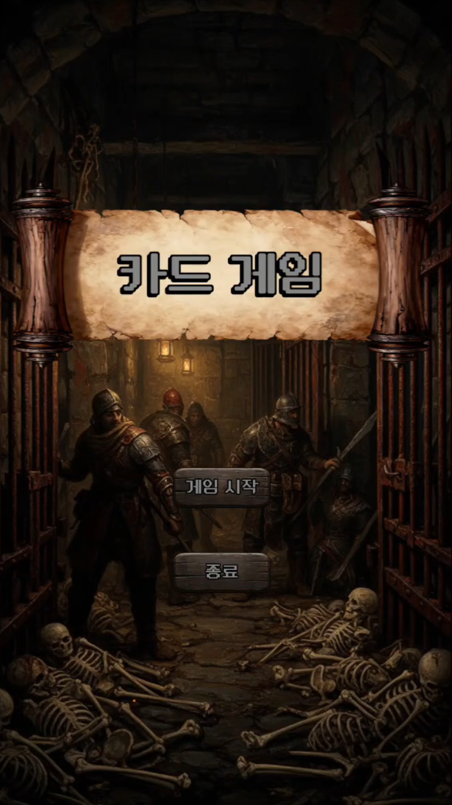
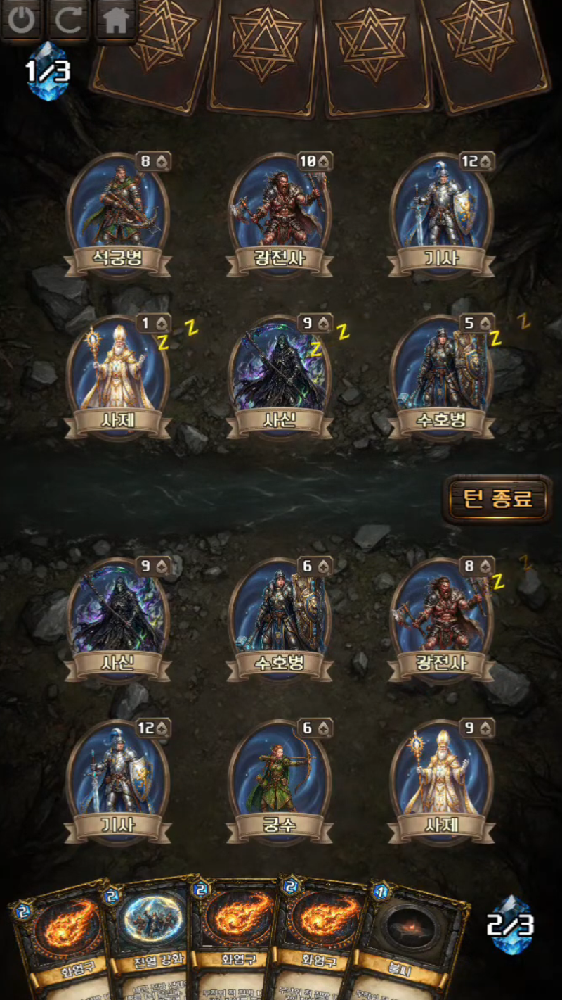

<div align="center">

# 턴제 카드 배틀

세로형 **턴제 카드 배틀** 프로토타입

</div>

---

## 📑 목차
- [📋 개요](#-개요)
- [🎬 인게임 사진](#-인게임-사진)
- [🔗 관련 링크](#-관련-링크)
- [✨ 주요 기능](#-주요-기능)
- [🎲 게임 디자인 의도](#-게임-디자인-의도)
- [🛠 기술 스택](#-기술-스택)
- [🏗 주요 아키텍처](#-주요-아키텍처)
- [📂 프로젝트 구조](#-프로젝트-구조)
- [🤖 AI · 외부 에셋 · 출처](#-ai--외부-에셋--출처)
- [🚀 추후 확장 방향](#-추후-확장-방향)

---

## 📋 개요
<table>
  <tr>
    <td>
      <table>
        <tr><td>기간</td><td>2026.06.19 ~ 06.25 (7일)</td></tr>
        <tr><td>인원</td><td>1명 (클라이언트)</td></tr>
        <tr><td>역할</td><td>클라이언트 개발</td></tr>
        <tr><td>도구</td><td>Unity 6000.5.0f1, C#</td></tr>
        <tr><td>타겟 기기</td><td>Android (64bit)</td></tr>
      </table>
  </tr>
</table>

세로형 **턴제 카드 배틀** 프로토타입입니다.

**AI 도구를 적극 활용해, 제한된 시간 안에 플레이 가능한 한 판의 카드 게임을 최대한 완성도 있게 구현**하는 것을 목표로 진행한 개인 프로젝트입니다.

규칙·턴 구조 같은 기본 틀 위에 "세팅 단계의 선택이 전투 결과로 이어지는" 수싸움을 얹어, *한 판을 지고 나면 배치를 바꿔 다시 해보고 싶어지는* 경험을 목표로 했습니다.

---

## 🎬 인게임 사진

<table>
  <tr>
    <td align="center">
      
      <br/>
      <b>타이틀 화면</b>
    </td>
    <td align="center">
      
      <br/>
      <b>인게임 — 전투 화면</b>
    </td>
  </tr>
</table>

---

## 🔗 관련 링크
<table>
  <tr><td>플레이 영상</td><td><a href="https://youtu.be/SeQlv4v4fQ0">바로가기</a></td></tr>
</table>

---

## ✨ 주요 기능

### 전투 시스템
- **턴제 진행** — 카드 선택 → 공격·스킬 처리 → HP 계산 → 카드 제거 → 신규 카드 자동 배치 → 승패 판정
- **룰 기반 상대 AI** — 상대 턴 자동 진행
- **카드 타입 6종 + 타입별 고유 효과**
  - 일반 / 원거리 / 무쌍 / 힐러 / **방패**(도발 + 피해 경감) / **흡혈**(가한 피해의 일부만큼 자가 회복)
- **마나 시스템** — 턴마다 회복(최대 3)되는 마나로 스킬 시전에 비용을 부여, *어떤 스킬을 언제 쓸지* 자원 관리
- **턴 시작 패시브 / 스킬 카드** — 단일·전열 버프, 전열 회복, 무작위 적 피해 등을 카드 외 별도 자원으로 분리

### 전략 요소
- **대기(후방) 카드도 공개 + 능동 효과 발동** — 원거리 후방 견제 / 무쌍 확률 충전 / 힐러 후방 힐 강화
- **타입별 공격 대기시간** — 전방 진입 후 공격까지의 대기 턴 차등 → 배치 단계의 수싸움
- **후방 카드 자동 승격** — 전방에 빈자리가 생기면 왼쪽부터 순서대로 전방으로 승격

### UI / 비주얼
- 전투 화면 / 카드 선택 / 현재 턴·HP 표시 / 승리·패배 결과 화면
- **자체 제작 리소스** — 카드 / 캐릭터 / 스킬 아이콘 / UI 전반
- **DOTween 연출** — 카드 이동·배치, UI 확대/축소, 데미지·HP 텍스트 팝업
- **셰이더 연출** — 디졸브(타이틀 → 인게임 전환), 홀로그램(카드 배치 가이드), 결과창 Blur

---

## 🎲 게임 디자인 의도

단순 기능 나열보다 **"제한된 범위 안에서도 다시 시도해보고 싶은 경험"** 을 목표로, 세 가지 디자인 선택을 핵심으로 삼았습니다.

### 1. 피해량 50% 설계
별도 공격 스탯 없이 **HP가 곧 피해량**인 구조입니다. 이대로 두면 HP 높은 카드끼리의 *"죽창 싸움"* 이 되어 한 번의 교전으로 승부가 나고 전략이 개입할 여지가 없습니다.

→ 모든 엔티티의 **기본·반격 피해를 현재 HP의 50%(최소 1)로 통일**해, 여러 턴에 걸친 *운영·교환*이 가능하도록 했습니다.
> 코드: `CombatSystem.DamageRatio = 0.5f`, `CounterRatio = 0.5f`

### 2. 대기 카드를 "공개 + 전투 참여"로
후방이 단순 대기 슬롯에 그치면 배치 단계의 의미가 약합니다.

→ **후방 카드도 앞면으로 공개**하고, 직접 공격은 못 하지만 **보유 효과를 발동**하도록 했습니다. *어떤 카드를 전방에 내고 어떤 효과를 후방에 둘지* 가 곧 전략이 됩니다.

### 3. 타입별 공격 대기시간
모든 카드가 처음부터 공격 가능하면 세팅 수싸움 없이 게임이 너무 빨리 끝납니다.

→ **타입별로 전방 진입 후 공격까지의 대기 턴**을 차등 부여해 강한 효과를 가진 타입의 밸런스를 맞췄습니다.

| 타입 | 대기 턴 | 타입 | 대기 턴 |
|------|:---:|------|:---:|
| 일반 / 힐러 | 0 | 원거리 | 1 |
| 방패 / 흡혈 | 0 | 무쌍 | 2 |

---

## 🛠 기술 스택

### 클라이언트
- **Unity 6000.5.0f1** - 게임 엔진
- **C#** - 프로그래밍 언어
- **JetBrains Rider 2026.1.0.1** - 통합 개발 환경

### 렌더링
- **2D URP (Universal Render Pipeline)** - 렌더 파이프라인

### 데이터 관리
- **ScriptableObject** - 카드(`ItemSO`)·스킬(`SkillSO`) 수치를 데이터로 분리, 코드 수정 없이 밸런스·콘텐츠 조정

### 디자인 패턴
- **Service Locator + DIP** - 역할 인터페이스 기반 의존성 관리
- **Strategy** - 카드 타입별 행동 분리
- **Command** - 스킬 효과 분리
- **Observer** - 이벤트 기반 UI 갱신
- **Template Method** - 카드 텍스트 포맷 공통화

---

## 🏗 주요 아키텍처

프로젝트 전반을 **SOLID 원칙과 확장 용이성**을 염두에 두고 설계했고, 개발을 진행하면서 구조를 점진적으로 개편·리팩토링해 다듬었습니다(기능 동작은 그대로 유지).

호출자가 구체 클래스가 아닌 **역할(인터페이스)** 에 의존하도록, 의존 그래프를 `Core/` 한 계층으로 수렴시켰습니다.

```
        ┌───────────────── Core/Contracts (역할 인터페이스 10종) ─────────────────┐
        │  ICombatSystem · IBoardState · ITurnManager · ISkillSystem · …          │
        └────────────────────────────────▲───────────────────────────────────────┘
                                          │ Services.Get<I>()  (DIP)
   ┌──────────────┬──────────────┬────────┴────────┬──────────────┬──────────────┐
 Managers     Controllers      Systems         Gameplay           UI
 TurnManager  BoardInput…      BoardPlacement  CardBehaviours/    ManaUI
 ManaManager                                   Combat/Skills/     ResultPanel
```

### 1️⃣ 싱글톤 → 서비스 로케이터 기반 DIP

**문제** — 매니저 간 참조를 처음에는 전역 `X.Inst` 싱글톤으로 구성했으나, 호출자가 구체 클래스에 직접 의존해 결합도가 높고 교체·테스트가 어려웠습니다.

**방법**
- `MonoService<T>` — `Awake`에서 자기 자신을 `Services`에 등록하고 `OnDestroy`에서 해제하는 자동 등록 베이스.
- **역할 인터페이스 10종** (`ICombatSystem`, `IBoardState`, `ITurnManager` …) 도입.
- 전역 호출 **129곳**을 `X.Inst.foo()` → `Services.Get<I>().foo()` 로 전환.

```csharp
public abstract class MonoService<T> : MonoBehaviour where T : class
{
    protected virtual void Awake()     => Services.Register<T>(this as T);
    protected virtual void OnDestroy() => Services.Unregister<T>(this as T);
}
```

**효과** — 호출자가 구체 클래스가 아닌 **"역할"** 에 의존(DIP)하게 되어 결합도가 낮아지고, 구현 교체·모킹이 가능해집니다.

### 2️⃣ Strategy 패턴 — 카드 타입 행동 분리

**문제** — 타입별 분기(`switch(CardType)`)가 표시 텍스트·전투 규칙·턴 시작 패시브·공격 연출 등 **여러 곳에 흩어져** 있어, 새 타입 추가 시 모든 분기를 찾아 고쳐야 했습니다.

**방법** — `ICardBehaviour` + 타입별 클래스(`NormalBehaviour`, `RangedBehaviour`, `MusouBehaviour`, `HealerBehaviour`, `ShieldBehaviour`, `VampireBehaviour`)로 분리. 한 카드 타입의 모든 행동이 **한 파일**에 모입니다.

**효과** — 새 카드 타입 = **클래스 1개 추가**(기존 코드 무수정). 개방-폐쇄 원칙(OCP)을 만족합니다.

### 3️⃣ Command 패턴 — 스킬 효과 분리

**문제** — 스킬 효과 처리가 `SkillSystem` 내부의 거대한 분기로 뭉쳐 있었습니다.

**방법** — `ISkillEffect` 인터페이스 + `Dictionary<ESkillEffect, ISkillEffect>` 라우팅으로 분리(`BuffSingleEffect`, `BuffAllFrontEffect`, `HealAllFrontEffect`, `RandomEnemyDamageEffect`). `SkillSystem`은 효과를 직접 알지 않고 **딕셔너리로 위임만 하는 얇은 디스패처**가 됩니다.

**효과** — 새 스킬 효과 = **구현 클래스 + 등록 1줄**.

### 그 외 구조 개선 *(요약)*
- **God Class 해체 (SRP)** — 653줄 `EntityManager`를 보드 상태 / 입력(`BoardInputController`) / 배치(`BoardPlacement`) / 진영(`Faction`)으로 책임 분리.
- **Observer 패턴 (이벤트 기반 UI)** — `ManaManager.ManaChanged → ManaUI`, `TurnManager.OnTurnStarted/OnAddCard`. UI가 상태를 폴링하지 않고 **구독**으로 갱신.
- **공용 액션 중앙화** — 종료/다시하기/메인메뉴를 `GameManager` 공용 액션으로 모으고, 버튼 `OnClick`을 메서드에 직접 연결(래퍼 패널 제거).
- **Template Method + readonly struct 컨텍스트** — `CardBehaviour` 베이스가 공통 텍스트 포맷을 처리하고 파생이 원본 데이터만 제공. `SkillContext`·`TurnPassiveContext`는 `readonly struct` + `in` 전달로 의존을 **값으로 주입(힙 할당 0)**.

---

## 📂 프로젝트 구조

```
Assets/Scripts/
├─ Core/
│  ├─ DI/          # Services, MonoService<T>
│  └─ Contracts/   # 역할 인터페이스 10종
├─ Gameplay/
│  ├─ CardBehaviours/  # ICardBehaviour + 타입별 전략
│  └─ Combat/
│     └─ Skills/       # ISkillEffect + 효과별 Command
├─ Managers/       # TurnManager, ManaManager, CardManager …
├─ Controllers/    # BoardInputController
├─ Systems/        # BoardPlacement
└─ UI/             # ManaUI, ActionBtn, ResultPanel …
```

---

## 🤖 AI · 외부 에셋 · 출처

### AI 도구
| 도구 | 활용 범위 |
|------|-----------|
| **Claude** | 코드 작성 · 리팩토링 · 디버깅 (주력). `CLAUDE.md` 프로젝트 규칙 파일과 Skill 파일로 커밋 규칙·코드 스타일·설계 원칙을 사전 정의해 **일관된 작업 환경을 구축**. |
| **Unity Assistant** | 하이어라키 세팅 · ScriptableObject 샘플 데이터 자동 생성 등 **에디터 작업 자동화로 세팅 속도 단축**. |
| **Gemini** | 기획 아이디어 · 연출 아이디어 · 그래픽 리소스(UI / 캐릭터 / 아이콘) 제작. |

### 외부 에셋
| 패키지 | 출처 / 용도 |
|--------|-------------|
| **DOTween** | [Demigiant](http://dotween.demigiant.com/) · 카드 이동·배치, UI 확대/축소, 데미지·HP 텍스트 팝업 등 전반 연출 |

> Unity 기본 제공 외 외부 패키지는 DOTween만 사용했습니다.

### AI 생성 리소스
- 모든 **그래픽 리소스(카드 / 캐릭터 / 스킬 아이콘 / UI)는 Gemini로 직접 제작**해 사용했습니다.
- **외부 에셋을 사용하지 않고 전부 자체 제작**하는 것을 목표로 진행했습니다.

---

## 🚀 추후 확장 방향

- **시스템 확장** — *카드 획득·성장 / 덱 구성·편집 / 카드 도감·컬렉션* 을 시간상 다루지 못했습니다. 추후 이를 추가하고, 맵을 이동하며 전투·회복·상점을 거치는 **탐험(로그라이크) 구조**로 확장하면 한 판의 깊이를 더 키울 수 있다고 봅니다.
- **비주얼 이펙트** — 자체 제작 방침상 타격·피격 **이펙트·파티클**이 부족합니다. 추후 파티클·셰이더 연출을 보강해 전투의 손맛을 강화하고 싶습니다.
</content>
